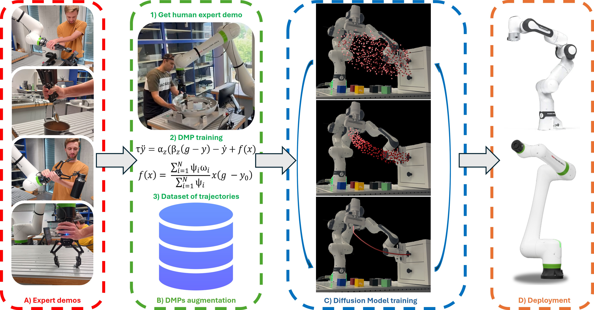
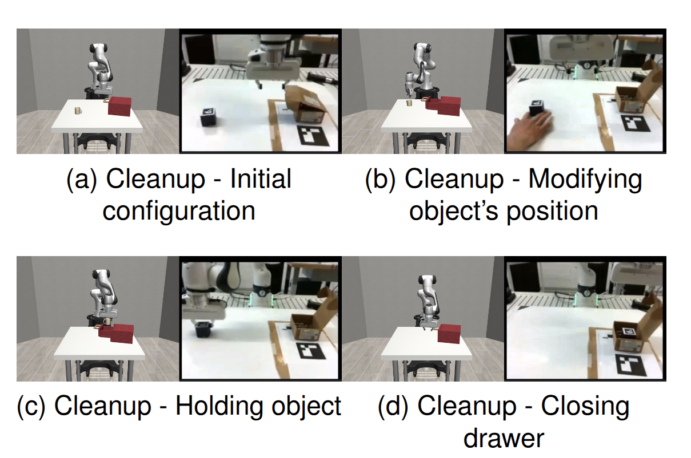
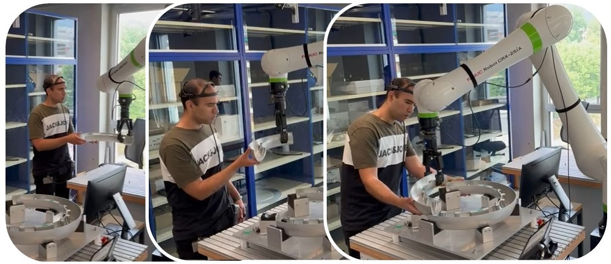
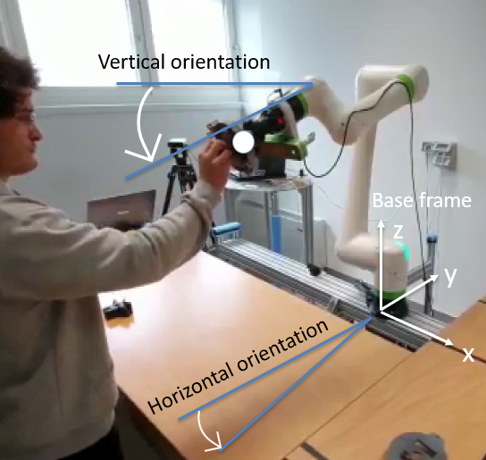

# Vincenzo Pomponi

  

<h2 align="center">PhD Researcher in Machine Learning & Robotics</h2>

  Università della Svizzera Italiana (USI) · SUPSI ARM Lab

  
  
  
  

---

# 👋 About Me

Hello! I’m **Vincenzo Pomponi**, an external PhD student at the [Università della Svizzera Italiana (USI)](https://www.usi.ch/en), Lugano, Switzerland, and a researcher at the [University of Applied Sciences and Arts of Southern Switzerland (SUPSI)](https://www.supsi.ch/en/home), within the [Automation Robotics and Machines Laboratory (ARM Lab)](https://www.supsi.ch/en/web/isteps/automation-robotics-and-machines).

I am supervised by:

- [Prof. Anna Valente](https://scholar.google.com/citations?hl=en&user=pO9TbIMAAAAJ&view_op=list_works&sortby=pubdate)
- [Prof. Luca Maria Gambardella](https://people.idsia.ch/~luca/)

I obtained both my **B.Sc.** and **M.Sc.** degrees in Mechanical Engineering from the [Politecnico di Milano (PoliMi)](https://www.mecheng.polimi.it/?lang=en).

My research focuses on the intersection of:

> **Machine Learning · Generative AI · Robotics**

with particular emphasis on:

- Learning from Demonstration (LfD)
- Diffusion-based robotic policies
- Multi-task robotic manipulation
- Vision-Language-Action models
- Generative robot learning systems

---

# 🔬 Research Interests

My current research investigates how **Generative AI** can improve robotic autonomy and generalization capabilities.

Main topics include:

- 🤖 **Robot Learning**
- 🧠 **Generative AI**
- 🌌 **Diffusion Models**
- 🎯 **Learning from Demonstration**
- 👁️ **Vision-Language-Action Models**

I am particularly interested in enabling robots to:

- generalize to unseen tasks,
- compose learned behaviors,
- exploit prior demonstrations,
- reason over long-horizon manipulation tasks,
- learn robust policies from multimodal data.

---

# 🏛 Research Experience

## 🔹 SUPSI — Scientific Collaborator

📅 **September 2022 – September 2023**

At SUPSI, I contributed to the European Horizon project:

### 🌍 [Fluently Project](https://www.fluently-horizonproject.eu/)

focused on developing advanced robot teaching methodologies for Human–Robot Collaboration (HRC) across multiple industrial tasks.

My work involved:

- robot programming by demonstration,
- collaborative robotics,
- task adaptation strategies,
- industrial automation workflows.

---

## 🔹 USI — PhD Researcher

📅 **Since September 2023**

Currently pursuing a PhD at USI in collaboration with SUPSI ARM Lab.

My ongoing research focuses on:

- Diffusion Policies for robotics
- Generative robotic manipulation
- Vision-Language-Action architectures
- Data generation for robot learning
- Multi-task policy learning
- Foundation models for robotics

---

# 🎓 Master Thesis

My master's thesis was developed in collaboration with:

- [STIIMA-CNR](https://www.stiima.cnr.it/?lang=en)
- [Dr. Hamid-Reza Karimi](https://scholar.google.no/citations?user=YcTS0ZMAAAAJ&hl=en)
- [Dr. Loris Roveda](https://scholar.google.com/citations?user=3un_pPgAAAAJ&hl=en)

---

# 📚 Publications & Projects

<table>
<tr>

<td width="300">

</td>

<td>

### DROM: A Multi-Skill Robotic Manipulation of Challenging Objects via Language-Guided Diffusion

📍 **Under review at IROS 2026**

DROM investigates how diffusion-based architectures can enable robust multi-task robotic manipulation through generative policy learning.

 

</td>

</tr>
</table>

---

<table>
<tr>

<td width="300">

</td>

<td>

### DynaMimicGen: A Data Generation Framework for Robot Learning of Dynamic Tasks

📍 **RA-L 2026**

DynaMimicGen generates diverse robotic trajectories from a very small number of demonstrations using DMP-based perturbation strategies.

 

</td>

</tr>
</table>

---

<table>
<tr>

<td width="300" align="center">
    
</td>

<td>

## Human-robot collaborative transport personalization via Dynamic Movement Primitives and velocity scaling

📍 **RO-MAN 2025**

This work introduces a novel approach to generate personalized trajectories using Dynamic Movement Primitives (DMPs), enhanced with real-time velocity scaling based on human feedback. The method was rigorously tested in industrial-grade experiments, focusing on the collaborative transport of an engine cowl lip section. 

 

</td>

</tr>
</table>

---

<table>
<tr>

<td width="300" align="center">
    
</td>

<td>

## A framework for human-robot collaboration enhanced by preference learning and ergonomics

📍 **Robotics and Computer-Integrated Manufacturing 2024**

The work proposes an **Active Preference Learning (APL)** framework for optimizing robot end-effector poses during collaborative tasks while integrating real-time ergonomic assessment of the human operator. The system improves collaboration quality by adapting robotic behavior according to ergonomic feedback and human preferences.

 

</td>

</tr>
</table>

---

# 🧪 Open-Source & Teaching

I actively develop and share educational and research material related to:

- Diffusion Models
- Robot Learning
- Generative AI for Robotics
- PyTorch implementations
- Learning from Demonstration
- Robotics education

---

## 🎓 Teaching Activities

### 📘 Diffusion Models — From Mathematical Foundations to Practical Coding
📍 Politecnico di Milano (PoliMi)

Topics covered:

- Forward & reverse diffusion processes
- DDPM & DDIM sampling
- Diffusion architectures
- Mathematical derivations
- Practical Python implementation

🔗 Repository:

  

---

### 🤖 Robotic Laboratory — Collaborative Robotics Practical Sessions
📍 SUPSI

Hands-on laboratory sessions focused on:

- collaborative robot programming,
- robotic manipulation,
- industrial automation,
- safe human–robot interaction.

---

# 🧪 Reviewing Activity

I currently serve as reviewer for:

- 📄 **IEEE Robotics and Automation Letters (RA-L)** — 2026
- 🤖 **IEEE/RSJ International Conference on Intelligent Robots and Systems (IROS)** — 2026
- 🚀 **IEEE International Conference on Robotics and Automation (ICRA)** — 2025
- 📚 **The International Journal of Robotics Research (IJRR)** — 2025

---

# 🌐 Links

| Platform | Link |
|---|---|
| Google Scholar | https://scholar.google.com/citations?user=ACuxQloAAAAJ&hl=en |
| LinkedIn | https://www.linkedin.com/in/vincenzo-pomponi-840649208/ |
| ResearchGate | https://www.researchgate.net/profile/Vincenzo-Pomponi-2 |
| GitHub | https://github.com/vincenzopomponi |

---

# 📫 Contact

Feel free to connect for:

- research collaborations,
- academic discussions,
- robotics & AI projects,
- open-source contributions.

📧 **vincenzo.pomponi@supsi.ch**

---

  <i>
    “Teaching robots to learn, generalize, and reason through generative intelligence.”
  </i>

