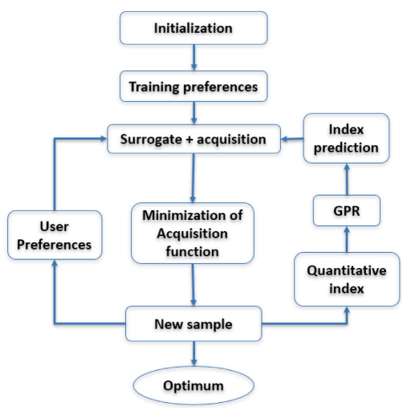
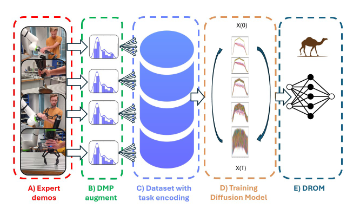

# Vincenzo Pomponi

Hello! I’m **Vincenzo Pomponi**, an external PhD student at the  
[Università della Svizzera Italiana (USI)](https://www.usi.ch/en), Lugano, Switzerland, and a researcher at the  
[University of Applied Sciences and Arts of Southern Switzerland (SUPSI)](https://www.supsi.ch/en/home), within the  
[Automation Robotics and Machines Laboratory (ARM Lab)](https://www.supsi.ch/en/web/isteps/automation-robotics-and-machines), supervised by  
[Prof. Anna Valente](https://scholar.google.com/citations?hl=en&user=pO9TbIMAAAAJ&view_op=list_works&sortby=pubdate).

I hold B.Sc. and M.Sc. degrees in Mechanical Engineering from the  
[Politecnico di Milano (PoliMi)](https://www.mecheng.polimi.it/?lang=en).

My master’s thesis—developed in collaboration with the  
[Institute of Intelligent Industrial Technologies and Systems for Advanced Manufacturing (STIIMA-CNR)](https://www.stiima.cnr.it/?lang=en) and supervised by  
[Dr. Hamiz-Reza Karimi](https://scholar.google.no/citations?user=YcTS0ZMAAAAJ&hl=en) and  
[Dr. Loris Roveda](https://scholar.google.com/citations?user=3un_pPgAAAAJ&hl=en)—focused on **Active Preference Learning (APL)** to optimize robot end-effector poses in **Human–Robot Collaboration (HRC)**.  
This work incorporates real-time ergonomic assessments to enhance human posture during shared tasks.  
The related publication is available [here](https://www.sciencedirect.com/science/article/pii/S073658452400067X).

---

## 🌐 Social

- [LinkedIn](https://www.linkedin.com/in/vincenzo-pomponi-840649208/)  
- [Google Scholar](https://scholar.google.com/citations?user=ACuxQloAAAAJ&hl=en)  
- [ResearchGate](https://www.researchgate.net/profile/Vincenzo-Pomponi-2?ev=hdr_xprf)

---

# 🔬 Current Research

From **September 2022 to September 2023**, I worked as a Scientific Collaborator at SUPSI, contributing to the  
[Horizon Europe *Fluently*](https://www.fluently-horizonproject.eu/) project, focusing on developing methods for teaching robots to collaborate with humans across multiple tasks.

Since **September 2023**, I have been pursuing my PhD at USI, supervised by  
[Prof. Dr. Luca Maria Gambardella](https://people.idsia.ch/~luca/) and  
[Prof. Dr. Anna Valente](https://scholar.google.com/citations?hl=en&user=pO9TbIMAAAAJ&view_op=list_works&sortby=pubdate).

My research interests lie at the intersection of:

- **Reinforcement Learning**  
- **Generative AI**  
- **Robotics**

with a particular focus on **Learning from Demonstration (LfD)**. I am especially interested in how **Diffusion Models** can enhance robots’ ability to leverage prior knowledge, enabling them to perform **novel and complex tasks** by composing or inferring task primitives.

---

# 📚 Publications & Preprints

### **A framework for human-robot collaboration enhanced by preference learning and ergonomics**

[Link to article](https://www.sciencedirect.com/science/article/pii/S073658452400067X)

 

---

### **DynaMimicGen: A Data Generation Framework for Robot Learning of Dynamic Tasks**

[arXiv preprint](https://arxiv.org/abs/2511.16223)

 

---

### **DROM: Multi-task Robotic Manipulation via Diffusion Models**

[GitHub repository](https://github.com/vincenzopomponi/DROM)

 

